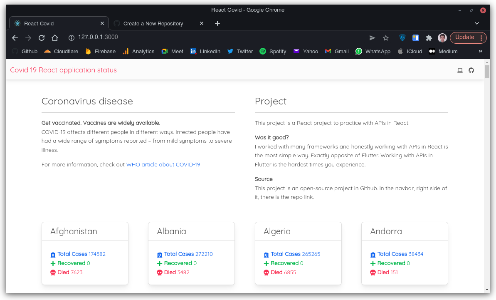
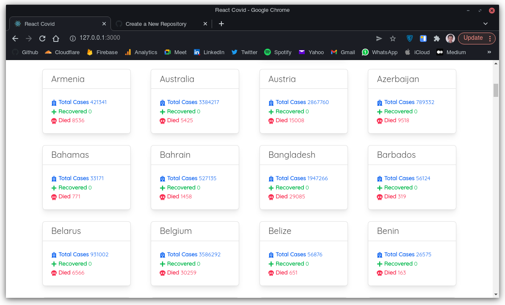
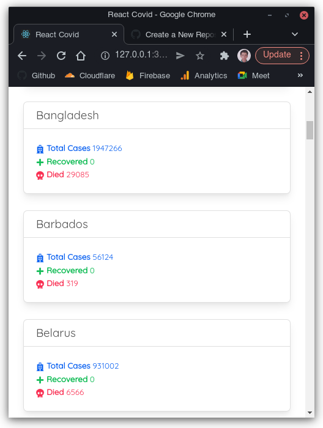

# Covid React

This a practical project to user APIs in a base level. Just fetch data and render it in components.

### API

This project use the same API that I used in [Flask Covid application](https://github.com/BlackIQ/Covid).

If you don't know, that is [http://covidapi.com](covidapi.com). But there is a problem I don't know why. It doesn't show recovered people count.

If you know any better API, please open an issue and suggest it.

### Preview





### My opinion

I worked with Flutter and Flask for APIs. The most simple way to use APIs is in React.

I didn't confused in this project exactly opposite of Flutter. I never learned how to use APIs in FLutter.

### How to run?

- Clone it

```shell
$ git clone https://github.com/BlackIQ/React-Covid && cd React-Covid
```

- Run it

```shell
$ npm start
```